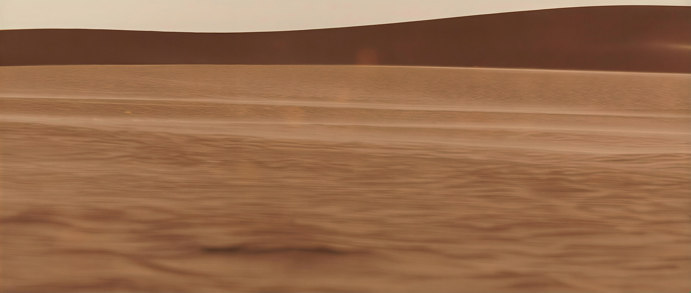
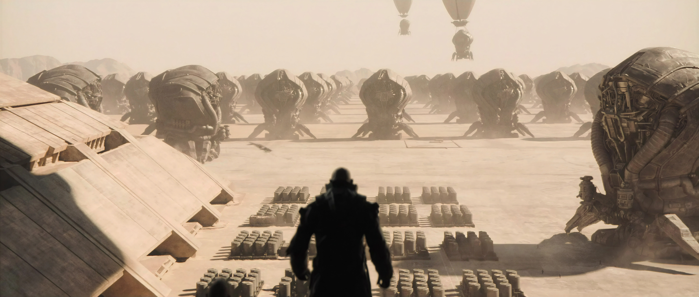
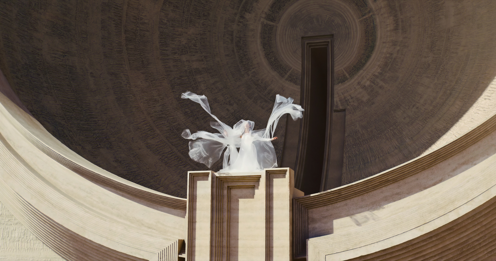
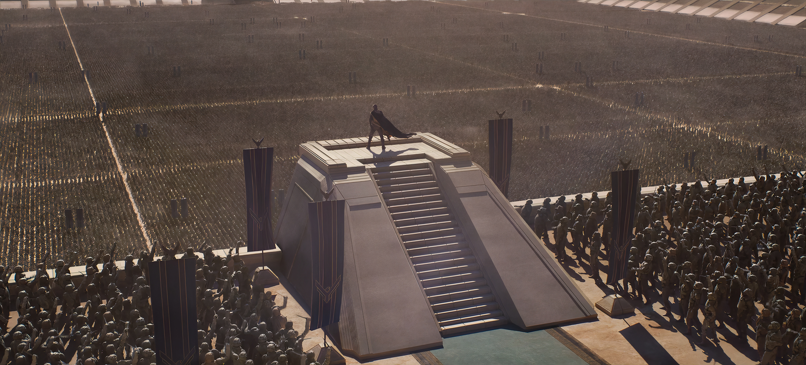
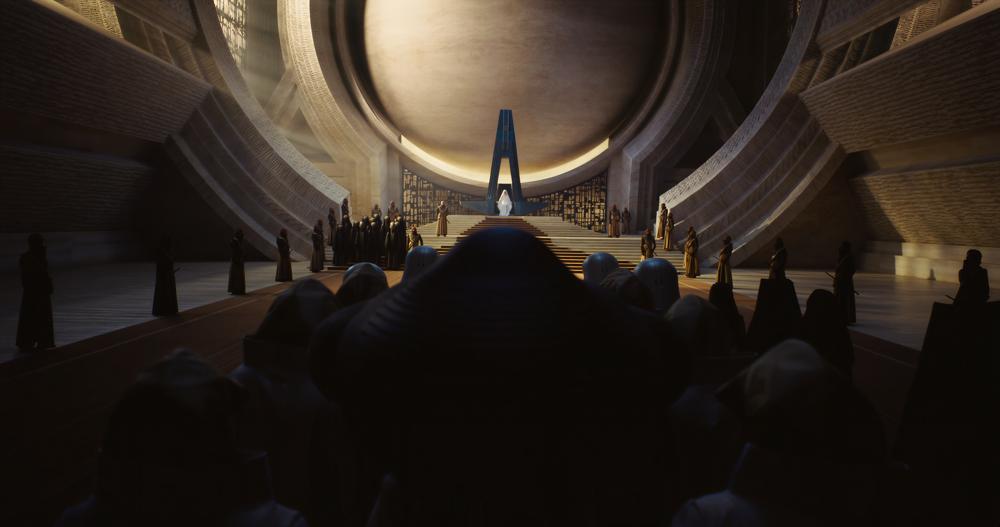

# Omarchy Dune Messiah Theme

Bleached stone, oxidized bronze, and a little ceremonial heat. Dune Messiah takes the Arrakis palette into daylight: parchment sand for the base, bitter spice reds and coppers for the accents, and a cold blue-green kept in reserve for the moments that need to cut through the dust.

## Preview


## Install

Use the standard Omarchy installer:

```bash
omarchy-theme-install https://github.com/OldJobobo/omarchy-dune-messiah-theme
```

## What's Included

- A custom `neovim.lua` for `bjarneo/aether.nvim`, with a full palette mapping tuned for this theme rather than a minimal colors override.
- A more heavily styled `walker.css` that gives the launcher its own framed, stone-panel treatment instead of leaving it at default palette coverage.
- Companion theme files for Zed, Chromium, Vencord, GTK/Aether, Waybar, Hyprland, Hyprlock, SwayOSD, Mako, and the shipped terminal configs.

## Wallpapers

<table>
  <tr>
    <td></td>
    <td></td>
    <td></td>
  </tr>
  <tr>
    <td></td>
    <td></td>
  </tr>
</table>

## Requirements

- `Yaru-wartybrown` for icons, as specified in `icons.theme`.

## Notes

- This is a light theme. The repo includes `light.mode`, and the palette is built around a pale sand background (`#dcd8d6`) with dark brown text (`#47362b`).

  
